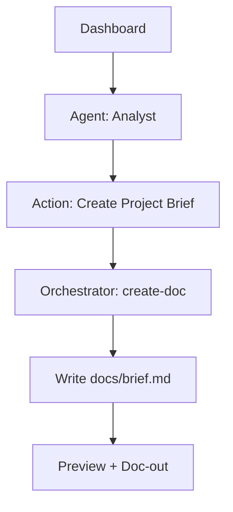
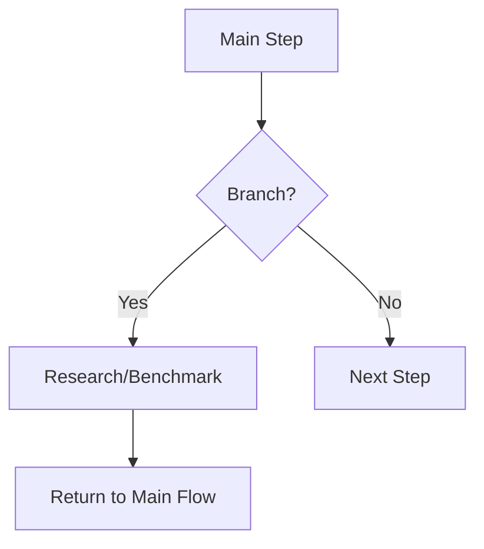
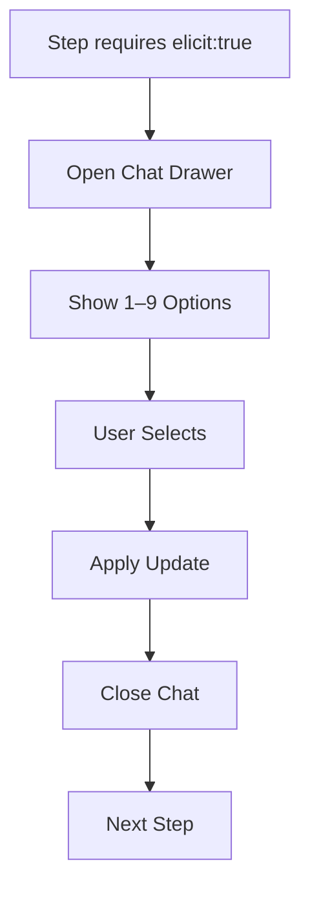

# Responsiveness Strategy

## Breakpoints

| Breakpoint | Min Width | Max Width | Target Devices        |
|------------|-----------|-----------|-----------------------|
| Mobile     | 0px       | 767px     | Phones                |
| Tablet     | 768px     | 1023px    | Small tablets         |
| Desktop    | 1024px    | 1439px    | Laptops/Desktops      |
| Wide       | 1440px    | -         | Large/Wide monitors   |

## Adaptation Patterns

**Layout Changes**
- Mobile: single‑column; 16px padding; nội dung ưu tiên theo flow
- Tablet: 1–2 cột; sidebar collapsible
- Desktop/Wide: 2–3 cột; sidebar cố định; panel phụ (Preview/Chat) song song

**Navigation Changes**
- Mobile: hamburger + bottom sheet cho Command Palette/Chat
- Tablet/Desktop: sidebar cố định; Command Palette (⌘K)
- Breadcrumbs luôn hiển thị trong Flow Runner

**Content Priority**
- Ưu tiên tác vụ chính/CTA; trì hoãn nội dung thứ cấp vào accordion/tabs
- Trên mobile, ẩn bớt metadata; cho phép “Xem thêm”

**Interaction Changes**
- Touch targets ≥ 44×44px; khoảng cách phù hợp
- Chat Drawer full‑height trên mobile; side‑drawer trên desktop
- Keyboard nav đầy đủ ở mọi breakpoint

---

# Accessibility Requirements

## Compliance Target
- Standard: WCAG AA
- Ngôn ngữ: `lang="vi"` mặc định; hỗ trợ chuyển `lang="en"` khi toggle

## Key Requirements
**Visual**
- Tương phản màu đáp ứng AA (văn bản/thành phần giao diện)
- Focus indicators rõ ràng, luôn hiển thị khi điều hướng bằng bàn phím
- Kích thước chữ tối thiểu/phân cấp heading nhất quán

**Interaction**
- Keyboard navigation đầy đủ; không bẫy focus; có “skip to content”
- Hỗ trợ screen reader (aria-label/aria-labelledby/role) theo ngôn ngữ hiện tại
- Touch targets ≥ 44×44px với khoảng cách hợp lý

**Content**
- Alt text đầy đủ cho hình ảnh/biểu tượng có ý nghĩa
- Cấu trúc heading logic (H1→H2→H3) và form labels rõ ràng
- Tooltip/Glossary có mô tả thân thiện non‑tech; giữ code/API/tên file tiếng Anh

## Testing Strategy
- Tự động: axe‑core/Lighthouse (a11y) trong CI; kiểm tra tương phản/mô tả aria
- Thủ công: walkthrough bàn phím, kiểm tra focus/skip links; smoke test với VoiceOver/NVDA
- Kiểm thử hồi quy: snapshot các trạng thái focus/hover; kiểm tra i18n aria khi toggle vi/en

---

# User Flows

## Flow 1: Start — chọn Loại dự án & Quy mô
- User Goal: Chọn Greenfield/Brownfield và Nhỏ/Lớn; xem “Hiểu quy trình”; persist lựa chọn; vào Dashboard.
- Entry Points: Start screen.
- Success Criteria: Lựa chọn được lưu; lộ trình chuẩn được load; đến Dashboard.

```mermaid
graph TD
  S[Start] --> T{Loại dự án}
  T -->|Greenfield| Q{Quy mô}
  T -->|Brownfield| Q
  S --> U[Hiểu quy trình (Modal)]
  Q -->|Nhỏ| D[Dashboard]
  Q -->|Lớn| D
```

## Flow 2: Chạy tác vụ từ Agent (Analyst → Create Project Brief)
- User Goal: Tạo Brief qua UI, xem preview, doc-out.
- Entry Points: Dashboard → Analyst → Action Card.
- Success Criteria: Gọi create-doc (project-brief-tmpl.yaml), cập nhật `docs/brief.md`, preview và doc-out thành công.



## Flow 3: Flow Runner — Rẽ nhánh và quay lại
- User Goal: Vào nhánh (research/benchmark), xong quay lại luồng chính.
- Entry Points: Flow Runner.
- Success Criteria: Ghi nhận branch_entered/exited; giữ tiến độ; quay lại đúng bước.



## Flow 4: Chat Elicitation 1–9 (on‑demand)
- User Goal: Mở Chat khi cần; chọn 1–9; cập nhật nội dung; đóng Chat.
- Entry Points: Any step yêu cầu elicit:true.
- Success Criteria: Tuân thủ 1–9; áp dụng thay đổi; telemetry chat_opened/closed.



## Flow 5: Settings — Token & Ngôn ngữ
- User Goal: Thiết lập ChatGPT token (client-side) và ngôn ngữ (vi/en).
- Entry Points: Settings.
- Success Criteria: Token hợp lệ và được lưu cục bộ; ngôn ngữ mặc định vi, toggle sang en được persist.

```mermaid
graph TD
  ST[Settings] --> TK[Enter/Validate Token]
  ST --> LG[Language Toggle vi/en]
  TK --> OK[Persist (client-side)]
  LG --> UI[Apply i18n]
```

---

# Information Architecture (IA)

## Site Map / Screen Inventory

```mermaid
graph TD
  A[Start: Project Type & Scale] --> B[Dashboard (Agents)]
  B --> B1[Agent: Analyst]
  B --> B2[Agent: PM]
  B --> B3[Agent: Architect]
  B --> B4[Agent: PO]
  B --> B5[Agent: SM]
  B --> B6[Agent: QA]
  B --> B7[Agent: Orchestrator]

  B --> C[Flow Runner]
  B --> D[Document Preview]
  B --> E[Settings (Token, i18n)]
  B --> F[Glossary & Help]
  B --> G[KPI Dashboard]

  A --> H[Understand Process (Modal)]
  C --> C1[Branch (research/benchmark)]
  C1 --> C2[Return to Main Flow]
```

## Navigation Structure

- Primary Navigation: Start, Dashboard, Flow Runner, Document Preview, Settings
- Secondary Navigation: Agent detail/actions (Analyst/PM/Architect/PO/SM/QA/Orchestrator), Glossary & Help, KPI Dashboard
- Breadcrumb Strategy: Flow Runner hiển thị bước/nhánh hiện tại; luôn có “Trở về luồng chính”

---

# Introduction

This document defines the user experience goals, information architecture, user flows, and visual design specifications for BMAD Brainstorming Web UI's user interface. It serves as the foundation for visual design and frontend development, ensuring a cohesive and user-centered experience.

---

# Change Log

| Date       | Version | Description                               | Author |
|------------|---------|-------------------------------------------|--------|
| 2025-08-09 | 0.1     | Khởi tạo UI/UX Specification (Introduction) | UX TBD |

---

# Overall UX Goals & Principles

## Target User Personas
- Non‑tech Stakeholder (PM/PO/Business): thao tác qua nút/bước; cần giải thích thuật ngữ; muốn “đường ray” và “Trở về luồng chính”.
- Technical User (Dev/QA/SM): cần mapping UI→BMAD rõ ràng; giảm đổi ngữ cảnh; xem/chỉnh artifacts nhanh.
- Administrator (tuỳ chọn): quản lý i18n, token LLM, cấu hình flow/workflows.

## Usability Goals
- Hoàn tất “Create Project Brief” không cần chat ≤ 5 phút.
- Tìm và chạy top 5 tác vụ (Analyst/PM/Architect) qua UI ≤ 3 click.
- Nhận biết agent hiện tại (role/chức năng) ≤ 2 giây.
- No‑chat completion rate ≥ 70% (MVP); đáp ứng WCAG AA cho tiêu chí cốt lõi.

## Design Principles
1. Clarity over cleverness: ngôn ngữ dễ hiểu; giữ code/API/tên file tiếng Anh, diễn giải tiếng Việt.
2. Progressive disclosure: guided flow + breadcrumbs + “Trở về luồng chính”.
3. Consistent patterns: Sidebar Agents + Action Cards + Command Palette + Chat Drawer.
4. Bilingual by default: vi/en toggle (mặc định vi); tooltip/glossary cho thuật ngữ.
5. Accessible by default: keyboard nav, aria đúng, focus ring, contrast AA.

---


